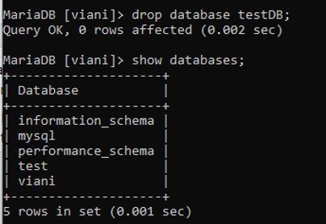
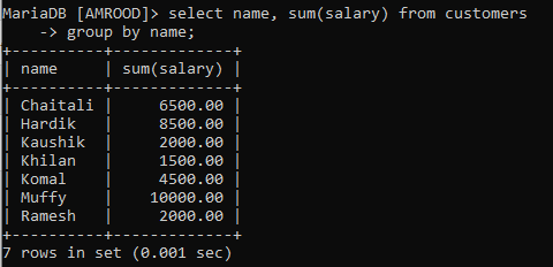
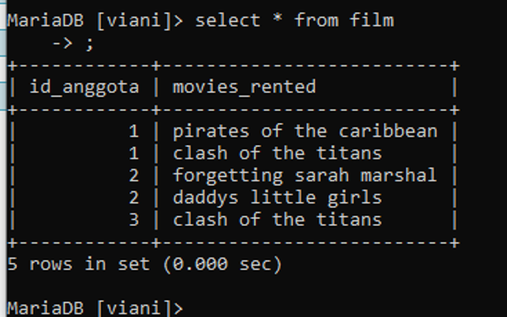

# Laporan Minggu 01
----

Nama : Dwi Oktaviani NK
NIM : 185610075

----

Latihan

Pada gambar 1 di praktikum ini kita menggunakan perintah create database testDB; yang berarti membuat database dengan nama testDB. Dan kita mencoba hasil tambahan database yang kita buat dengan perintah show databases; 

Pada gambar 2 di praktikum ini kita menggunakan perintah drop database testDB; yang berarti kita akan menghapus database sekaligus semua tabel yang ada didalam database testDB. Dan kita mencoba hasil tambahan database yang kita buat dengan perintah show databases; 

Tugas

