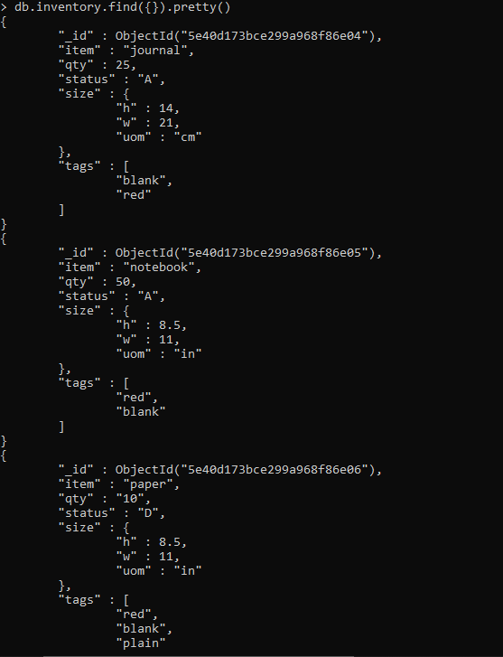

# Laporan Minggu 02
----

Nama : Dwi Oktaviani NK
NIM : 185610075

----

pada gambar 1 use digunakan untuk membuat database sedangkan db digunakan untuk melihat database.

pada gambar 2 menggunakan metode db.collection.insertMany () untuk menyisipkan dokumen baru ke dalam koleksi inventaris.

pada gambar 3, 4, 5, 6 kita memilih dokumen dari koleksi, dengan menggunakan metode db.collection.find (). Untuk memilih semua dokumen dalam koleksi, berikan dokumen kosong sebagai dokumen filter kueri ke metode. Dan juga kita menentukan dengan jelas apa yang akan kita cari misalnya : db.inventory.find( { status: "D" } ); artinya kita mencari dari data yang sudah kita buat yang memiliki status D.

