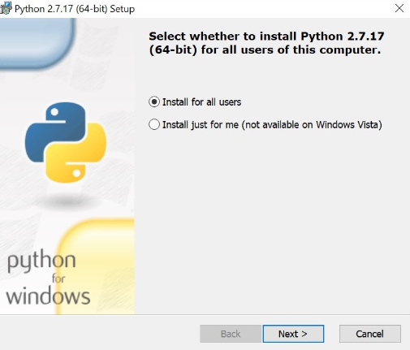
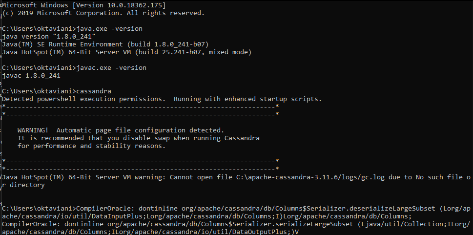
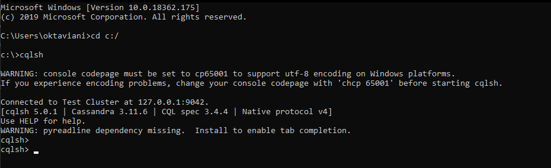
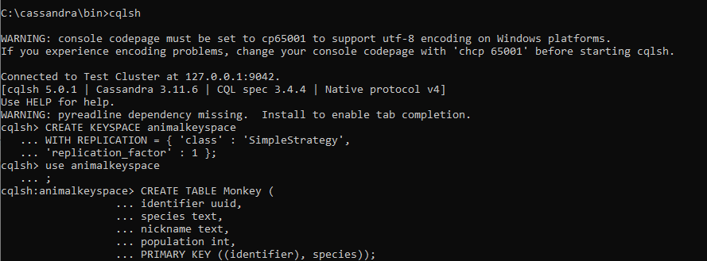

# Laporan Minggu 06
----

Nama : Dwi Oktaviani NK
NIM : 185610075

----

Latihan

Pada gambar 1 di praktikum ini kita akan melakukan installasi aplikasi python untuk membantu kita mengerjakan latihan dan tugas pada apache cassandra.

Pada gambar 2 di praktikum ini kita memindahkan file folder apache cassandra yang telah kita insall  ke disk C agar dapat kita jalankan dengan mudah.

Pada gambar 3 di praktikum ini, setelah kita berhasil mendownload jdk maka kita harus mengatur terlebih dahulu pada Edit Environment Variable. Kita hanya perlu search Environment lalu klik Edit the system environment variable. Kemudian akan muncul tab sebelah kiri maka pilih yang Environmrnt Variable. Lalu akan muncul tab seperti sebelah kanan bawah kita pilih pada system variables dan klik yang Path. Maka akan muncul tab seperti kanan atas maka kita akan memasukkan file lokasi penyimpanan aplikasi python dan juga apache cassandra.

Pada gambar 4 di praktikum ini, kita coba buka CMD lalu kita pastikan java yang kita install telah berhasil dan juga untuk melihat versi java yang kita install. Dengan menggunakan perintah java.exe -version dan juga javac.exe -version. Setelah itu kita coba menjalankan Cassandra dengan mengetikkan cassandra.

Pada gambar 5 di praktikum ini, kita membuka tab CMD baru dan tab yang tadi jangan di close. Selanjutnya kita coba ketik cd c:/ yang fungsinya kita akan masuk di direktori c:/. Kemudian kita coba ketikkan cqlsh untuk menjalankan cassandra seperti gambar diatas. Jika sudah muncul cqlsh> maka kita dapat langsung menggunakan cassandra yang sudah berhasil kita install dan kita jalankan.

Tugas

Pada gambar 6 di praktikum ini, kita akan membuat keyspace dengan perintah CREATE KEYSPACE animal keyspace WITH REPLICATION = { 'class' : 'SimpleStrategy', 'replication_factor' : 1 }; dan disini kita menggunakan nama animalkeyspace untuk nama keyspacenya.
Setelah itu kita menggunakan perintah USE untuk menggunakan keyspace yang sudah kita buat tadi. Maka akan muncul cqlsh:animalkeyspace>.
Lalu kita membuat tabel dalam keyspace tersebut dengan menggunakan perintah CREATE TABLE dan kita isikan data apa saja yang akan ada dalam tabel tersebut.

Pada gambar 7 di praktikum ini, kita akan memasukan beberapa isian data pada tabel keyspace dengan menggunakan perintah INSERT INTO dan dengan VALUES yang ada seperti pada gambar diatas.
Kemudian kita menggunakan perintah select * from Monkey; yang memiliki fungsi untuk menampilkan isian dan data yang ada pada tabel Monkey yang sudah kita buat tadi.

Pada gambar 8 di praktikum ini, kita melanjutkan menambahkan isian data yang ada pada tabel Monkey dengan langkah yang sama seperti gambar 7 dengan menggunakan perintah INSERT INTO kemudian VALUES.

Pada gambar 9 di praktikum ini, kita menambahkan lagi isian data yang ada pada tabel Monkey dengan langkah yang sama dengan gambar 7 dan gambar 8. 
Kemudian kita coba cek kembali semua isian tabel Monkey dengan menggunakan perintah select * from Monkey;. Yang sebelumnya pada gambar 7 hanya ada 1 isian, setelah kita menambahkan lagi 2 isian maka akan berambah menjadi 3 seperti gambar diatas.
