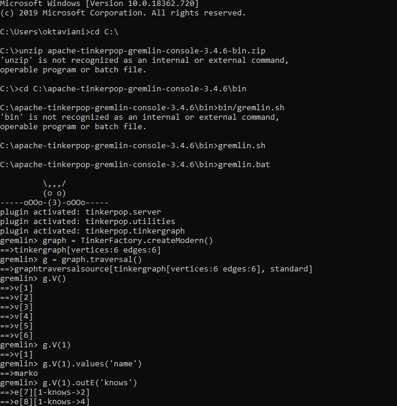
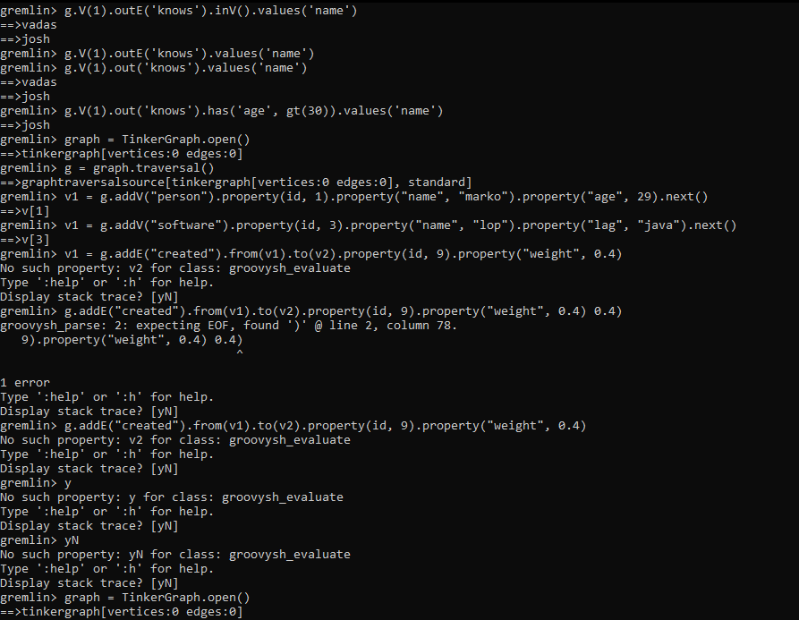
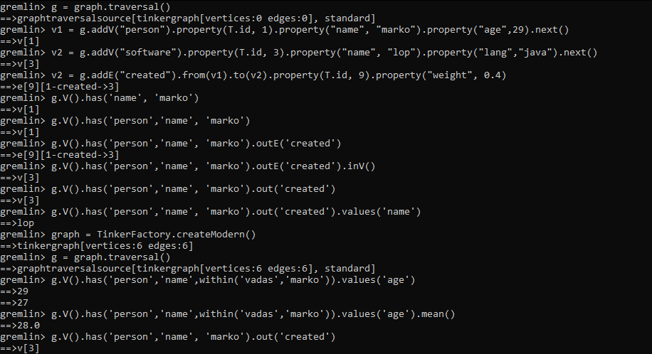
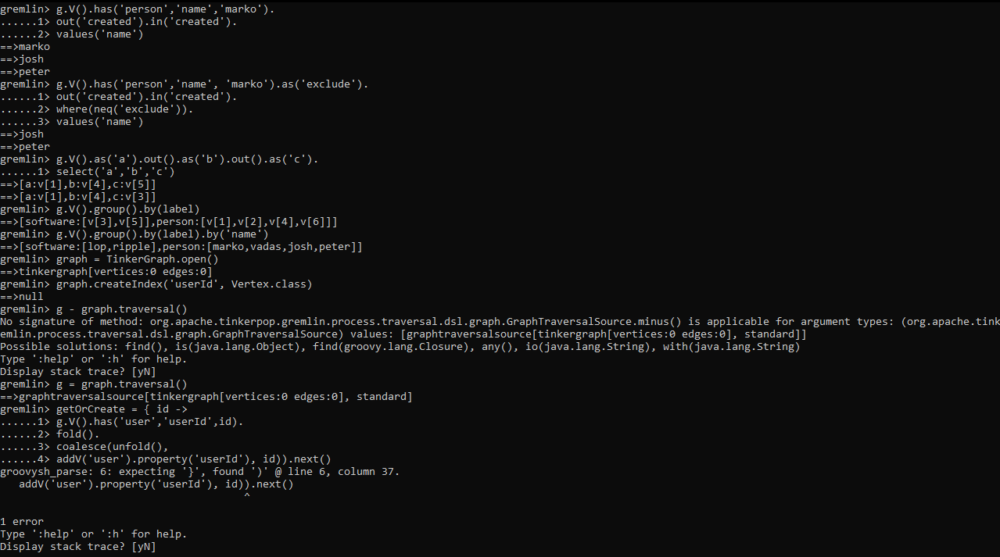
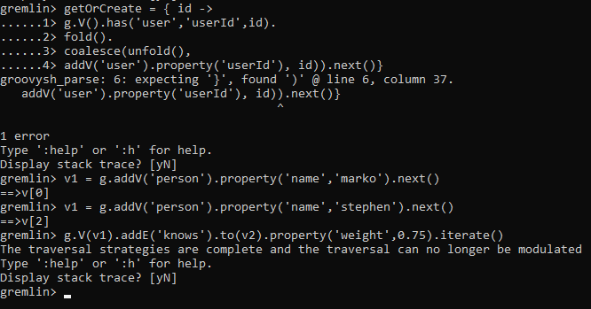

# Laporan Minggu 08
----

Nama : Dwi Oktaviani NK
NIM : 185610075

----
Latihan

----
Tugas
1. JanusGraph adalah sumber terbuka, database grafik terdistribusi di bawah The Linux Foundation. JanusGraph tersedia di bawah Lisensi Apache 2.0 . Proyek ini didukung oleh IBM, Google, dan Hortonworks. JanusGraph mendukung berbagai backend penyimpanan ( Apache Cassandra , Apache HBase , Google Cloud Bigtable , Oracle BerkeleyDB , Scylla ). Skalabilitas JanusGraph tergantung pada teknologi yang mendasarinya, yang digunakan dengan JanusGraph. Misalnya, dengan menggunakan Apache Cassandra sebagai penskalaan backend penyimpanan ke beberapa pusat data disediakan di luar kotak. JanusGraph mendukung analisis, pelaporan, dan ETL data grafik global melalui integrasi dengan platform data besar ( Apache Spark , Apache Giraph , Apache Hadoop ).  
JanusGraph mendukung pencarian geo, numerik, dan teks lengkap melalui penyimpanan indeks eksternal ( ElasticSearch , Apache Solr , Apache Lucene ). JanusGraph memiliki integrasi asli dengan tumpukan grafik Apache TinkerPop ( bahasa permintaan grafik GREMLIN, server grafik GREMLIN , aplikasi GREMLIN ). 

2. 